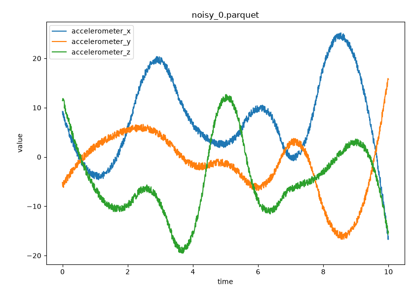

# Simulation of an Accelerometer in Space

Tools for producing synthetic sensor readings of an accelerometer, gyroscope, and/or magnetometer under various kinds of motion.



Assumptions:

* We don't travel very far so that the curvature of the planet isn't a concern:
  - North is always the same direction.
  - Gravity always points down as the sensor moves in space.

## Simulation

The simulation models an accelerometer, magnetometer, and gyroscope starting with zero velocity at the origin and outputs synthetic, noisy sensor readings as it moves through space and changes orientation. The velocity must start at zero since it cannot otherwise be inferred from the readings. This is key because we intend to train a machine learning model on the artificial sensor data to predict the position and orientation of the sensor.

For position/velocity/acceleration data, we create a sequence of $`P`$ varying reference velocity values as 3D vectors, $`\mathbf{v}_i`$, with equal time displacement where $`\mathbf{v}_0 = 0`$. We interpolate through these values with a differentiable function (a cubic spline in this case) to create a continuous function $`\mathbf{v}(t)`$ that satisfies $`\mathbf{v}(t_i) = \mathbf{v}_i`$ for each reference time $`t_i`$. The integral of this function gives us the position of the sensor, $`\mathbf{x}(t)`$, and the derivative gives us its acceleration, $`\mathbf{a}(t)`$ (without consideration for its orientation).

For orientation, we create a sequence of $`P`$ varying reference angular velocities as 3D vectors $`\mathbf{\omega}_i`$ and also select an initial rotation vector $`\mathbf{R}_0`$. We similarly interpolate through $`\mathbf{\omega}_i`$ to create a continuous function $`\mathbf{\omega}(t)`$ that satisfies $`\mathbf{\omega}(t_i) = \mathbf{\omega}_i`$ for each reference time $`t_i`$. The integral of this function plus initial rotation $`\mathbf{R}_0`$ is its rotation, $`\mathbf{R}(t)`$, satisfying $`\mathbf{R}(t_0) = \mathbf{R}_0`$.

To produce accelerometer and magnetometer readings we apply Rodrigues' rotation formula, which we'll denote with $`\mathcal{R}`$, in various ways. Let $`\mathbf{g}`$ be a vector representing the acceleration due to gravity (it points "down") and $`\mathbf{m}`$ be a vector representing the planet's magnetic flux density (it points "north").

The target accelerometer reading is $`\mathbf{a_t}(t) = \mathcal{R}(-\mathbf{R}(t),\mathbf{g}-\mathbf{a}(t))`$. The target magnetometer reading is $`\mathbf{m_t}(t) = \mathcal{R}(-\mathbf{R}(t),\mathbf{m})`$. The target gyroscope reading is $`\mathbf{\omega_t}(t) = \mathbf{\omega}(t)`$.

We choose $`S`$ sample times $`w_k`$ where $`t_0 \le w_k \le t_{P-1}`$ to sample the readings. Values for $`w_k`$ are initially chosen with equal spacing over the time range, but are "jittered" by altering them by amounts chosen from a normal distribution since the sensor operates at a regular interval, but not perfectly. Noisy readings are produced by sampling the true readings at times $`w_k`$ and then adding white noise (via a uniform distribution) to produce $`\mathbf{a_n}(w_k)`$, $`\mathbf{m_n}(w_k)`$, and $`\mathbf{\omega_n}(w_k)`$.

Reference data, target data, and noisy data are saved to separate files:

* Reference data: $`t_i`$, $`\mathbf{x}(t_i)`$, $`\mathbf{v}(t_i)`$, $`\mathbf{a}(t_i)`$, $`\mathbf{\omega}(t_i)`$, $`\mathbf{R}(t_i)`$.
* Target data: $`w_k`$, $`\mathbf{x}(w_k)`$, $`\mathbf{v}(w_k)`$, $`\mathbf{a}(w_k)`$, $`\mathbf{a_t}(w_k)`$, $`\mathbf{m_t}(w_k)`$, $`\mathbf{\omega_t}(w_k)`$, $`\mathbf{R}(w_k)`$.
* Noisy data:  $`w_k`$, $`\mathbf{a_n}(w_k)`$, $`\mathbf{m_n}(w_k)`$, $`\mathbf{\omega_n}(w_k)`$.

Then a model can be trained from the noisy data to predict whichever data is interesting in the target data.

## Setup

Required libraries:

```bash
pip install numpy scipy matplotlib pyarrow
```

## Examples

```
python3 simulation_position_and_orientation.py -o out
```

This will create synthetic sensor data and supporting information in the `out` directory:

* `reference_#.parquet` - Data about sample true reference points.
* `target_#.parquet` - Perfect sensor readings with sensor timing jitter.
* `noisy_#.parquet` - Noisy sensor readings with the same sensor timing jitter.
